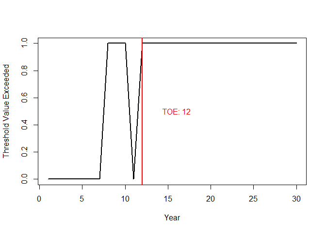

<!-- README.md is generated from README.Rmd. Please edit that file -->

# phenometrics

<!-- badges: start -->

<!-- badges: end -->

This package is designed to calculate, summarize, and plot Time of
Emergence (ToE)-based metrics describing and contextualizing how
species’ phenologies respond to climate change. It contains tools to
detect the point at which a species’ phenology emerges from its original
state to establish a new regime, both in terms of the time at which its
phenology occurs, as well as the environmental conditions under which it
occurs. It also contains tools to detect the timing of ecological
mismatch, and functions to summarize multi-species results into
community-wide indicators to analyze the effects of climate change on
community phenology as a whole.

## Installation

You can install the development version of phenometrics from
[GitHub](https://github.com/) with:

``` r
# install.packages("pak")
pak::pak("reidsteele2/phenometrics")
```

## Example

Unlike standard phenological analyses, which tend to focus on rates of
change, phenometrics calculates Time of Emergence (ToE) metrics, which
attempt to identify the exact point at which a species’ phenology has
exceeded its historical variability and established a new normal. The
phenometrics package assumes input data is provided as a data frame,
with standardized column names:

year: Year of the phenological event. species: Unique species
identifier. Can be numeric or character. event: Time at which the
phenological event occurs, typically in Julian day. env: Environmental
conditions (usually temperature) at which the phenological event occurs.

The basic worker function in the phenometrics package is `emp_tope()`,
which calculates the Time of Phenological Emergence (ToPE) for a species
using empirical methodology.

``` r
# library
library(phenometrics)

# Set seed
set.seed(123)

# Create test dataset
year = seq(1,30,1)
event = round(rnorm(30, 100, 5))- seq(1,30,1)
dataset = data.frame(year, event)

# Calculate empirical time of phenological emergence (ToPE)
emp_tope(dataset)
```



    #>    year p emerged
    #> 1     1 0       0
    #> 2     2 0       0
    #> 3     3 0       0
    #> 4     4 0       0
    #> 5     5 0       0
    #> 6     6 0       0
    #> 7     7 0       0
    #> 8     8 1       0
    #> 9     9 1       0
    #> 10   10 1       0
    #> 11   11 0       0
    #> 12   12 1       1
    #> 13   13 1       1
    #> 14   14 1       1
    #> 15   15 1       1
    #> 16   16 1       1
    #> 17   17 1       1
    #> 18   18 1       1
    #> 19   19 1       1
    #> 20   20 1       1
    #> 21   21 1       1
    #> 22   22 1       1
    #> 23   23 1       1
    #> 24   24 1       1
    #> 25   25 1       1
    #> 26   26 1       1
    #> 27   27 1      NA
    #> 28   28 1      NA
    #> 29   29 1      NA
    #> 30   30 1      NA

What is special about using `README.Rmd` instead of just `README.md`?
You can include R chunks like so:

``` r
summary(cars)
#>      speed           dist       
#>  Min.   : 4.0   Min.   :  2.00  
#>  1st Qu.:12.0   1st Qu.: 26.00  
#>  Median :15.0   Median : 36.00  
#>  Mean   :15.4   Mean   : 42.98  
#>  3rd Qu.:19.0   3rd Qu.: 56.00  
#>  Max.   :25.0   Max.   :120.00
```

You’ll still need to render `README.Rmd` regularly, to keep `README.md`
up-to-date. `devtools::build_readme()` is handy for this.

You can also embed plots, for example:


In that case, don’t forget to commit and push the resulting figure
files, so they display on GitHub and CRAN.
