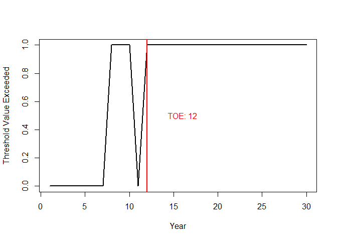
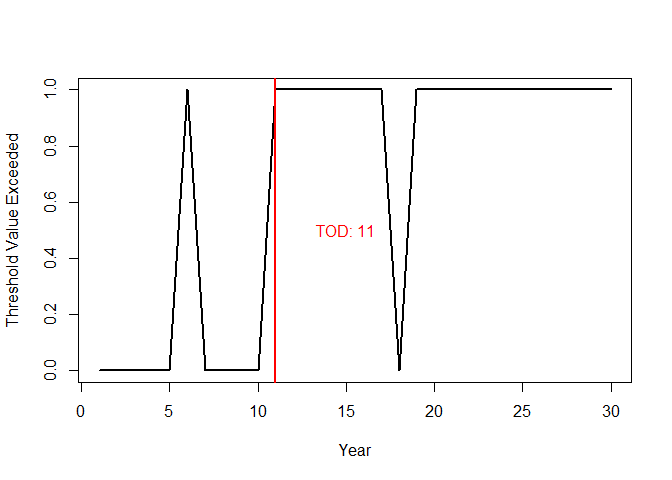
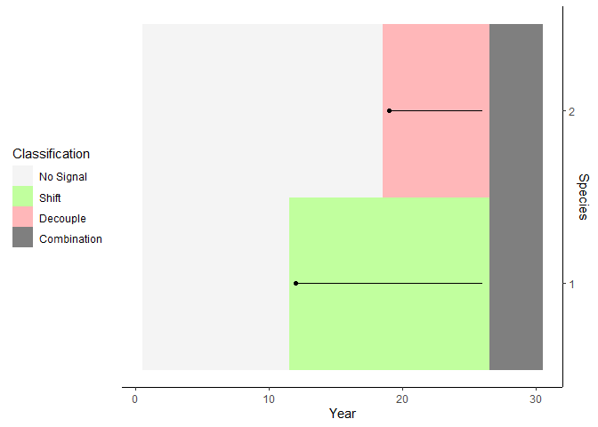
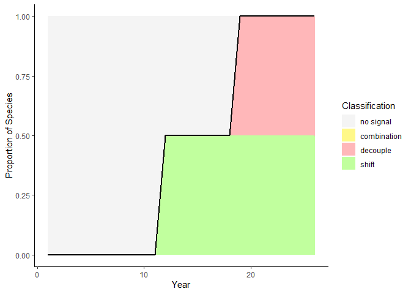
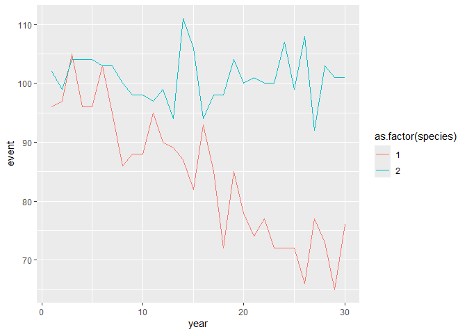
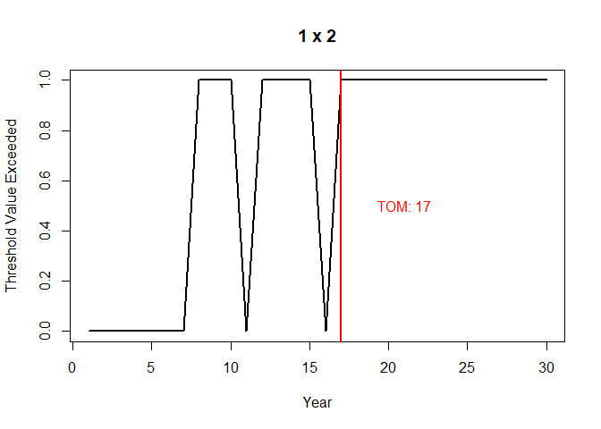
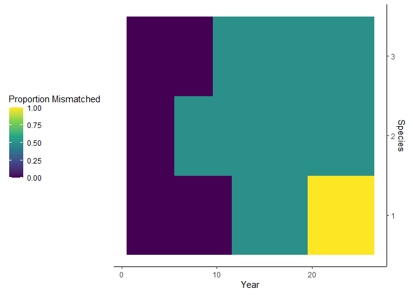
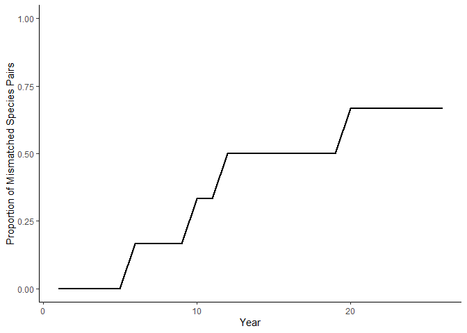
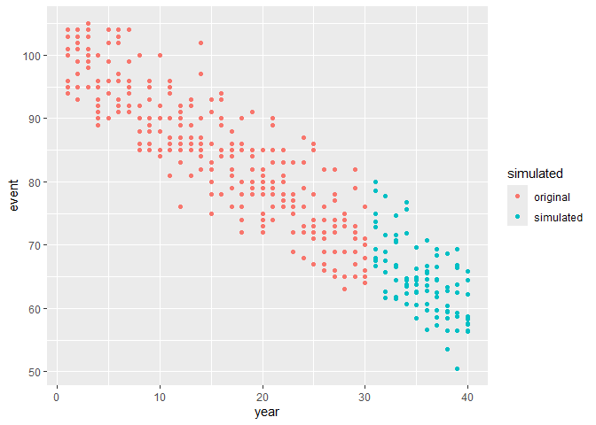

<!-- README.md is generated from README.Rmd. Please edit that file -->

# phenometrics

<!-- badges: start -->

<!-- badges: end -->

This package is designed to calculate, summarize, and plot Time of
Emergence (ToE)-based metrics describing and contextualizing how
species’ phenologies respond to climate change. It contains tools to
detect the point at which a species’ phenology emerges from its original
state to establish a new regime, both in terms of the time at which its
phenology occurs, as well as the environmental conditions under which it
occurs. It also contains tools to detect the timing of ecological
mismatch, and functions to summarize multi-species results into
community-wide indicators to analyze the effects of climate change on
community phenology as a whole.

## Installation

You can install the development version of phenometrics from
[GitHub](https://github.com/) with:

``` r
# install.packages("pak")
pak::pak("reidsteele2/phenometrics")
```

## Example

Unlike standard phenological analyses, which tend to focus on rates of
change, phenometrics calculates Time of Emergence (ToE) metrics, which
attempt to identify the exact point at which a species’ phenology has
exceeded its historical variability and established a new normal. The
phenometrics package assumes input data is provided as a data frame,
with standardized column names:

`year`: Year of the phenological event. `species`: Unique species
identifier. Can be numeric or character. `event`: Time at which the
phenological event occurs, typically in Julian day. `env`: Environmental
conditions (usually temperature) at which the phenological event occurs.

The basic worker function in the phenometrics package is `emp_tope()`,
which calculates the Time of Phenological Emergence (ToPE) for a species
using empirical methodology.

``` r
# library
library(phenometrics)
library(tidyverse)
#> ── Attaching core tidyverse packages ──────────────────────── tidyverse 2.0.0 ──
#> ✔ dplyr     1.1.4     ✔ readr     2.1.5
#> ✔ forcats   1.0.0     ✔ stringr   1.5.1
#> ✔ ggplot2   3.5.2     ✔ tibble    3.2.1
#> ✔ lubridate 1.9.4     ✔ tidyr     1.3.1
#> ✔ purrr     1.0.4     
#> ── Conflicts ────────────────────────────────────────── tidyverse_conflicts() ──
#> ✖ dplyr::filter() masks stats::filter()
#> ✖ dplyr::lag()    masks stats::lag()
#> ℹ Use the conflicted package (<http://conflicted.r-lib.org/>) to force all conflicts to become errors

# Set seed
set.seed(123)

# Create test dataset
year = seq(1,30,1)
event = round(rnorm(30, 100, 5))- seq(1,30,1)
dataset = data.frame(year, event)

# Calculate empirical time of phenological emergence (ToPE)
emp_tope(dataset)
```



    #>    year p emerged
    #> 1     1 0       0
    #> 2     2 0       0
    #> 3     3 0       0
    #> 4     4 0       0
    #> 5     5 0       0
    #> 6     6 0       0
    #> 7     7 0       0
    #> 8     8 1       0
    #> 9     9 1       0
    #> 10   10 1       0
    #> 11   11 0       0
    #> 12   12 1       1
    #> 13   13 1       1
    #> 14   14 1       1
    #> 15   15 1       1
    #> 16   16 1       1
    #> 17   17 1       1
    #> 18   18 1       1
    #> 19   19 1       1
    #> 20   20 1       1
    #> 21   21 1       1
    #> 22   22 1       1
    #> 23   23 1       1
    #> 24   24 1       1
    #> 25   25 1       1
    #> 26   26 1       1
    #> 27   27 1      NA
    #> 28   28 1      NA
    #> 29   29 1      NA
    #> 30   30 1      NA

By default, this function outputs a data frame that contains the year,
test value p (1 = positive test value, indicating that year has exceeded
historical variability), emergence status (1 = emerged, 0 = not
emerged). Emergence occurs once a certain number of consecutive years
return positive test values (set to 5 by default). Unless told not to,
it also generates a plot of test results against year, and if
applicable, indicates the point at which emergence occurs.

The mirror function to `emp_tope()` is `emp_toee()`, which examines the
environmental conditions a phenological event occurs at rather than its
timing. We refer to this as the Time of Environmental Emergence (ToEE).

``` r
# Set seed
set.seed(123)

# Create test dataset
year = seq(1,30,1)
env = (rnorm(30, 15, 0.5)) + seq(0.1,3,0.1)
dataset = data.frame(year, env)

# Calculate empirical time of phenological emergence (ToPE)
emp_toee(dataset)
```



    #>    year p emerged
    #> 1     1 0       0
    #> 2     2 0       0
    #> 3     3 0       0
    #> 4     4 0       0
    #> 5     5 0       0
    #> 6     6 1       0
    #> 7     7 0       0
    #> 8     8 0       0
    #> 9     9 0       0
    #> 10   10 0       0
    #> 11   11 1       1
    #> 12   12 1       1
    #> 13   13 1       1
    #> 14   14 1       1
    #> 15   15 1       1
    #> 16   16 1       1
    #> 17   17 1       1
    #> 18   18 0       1
    #> 19   19 1       1
    #> 20   20 1       1
    #> 21   21 1       1
    #> 22   22 1       1
    #> 23   23 1       1
    #> 24   24 1       1
    #> 25   25 1       1
    #> 26   26 1       1
    #> 27   27 1      NA
    #> 28   28 1      NA
    #> 29   29 1      NA
    #> 30   30 1      NA

This function performs the same analyses as `emp_tope()`, but on the
`env` column instead of the `event` column. Together, `emp_tope()` and
`emp_toee()` can be used to classify a species’ phenological response to
climate change. For example, if a species emerges in ToPE but not ToEE,
then it is shifting its phenology in time to maintain the environmental
conditions of its phenology. Conversely, a species emerged in ToEE and
not ToPE is doing the opposite: it is maintaing the timing of its
phenology at the expense of changing environmental conditions under
which it occurs.

phenometrics also contains community-level functions that work as
wrappers to `emp_tope()` and `emp_toee()` to perform many ToPE and ToEE
calculations and summarize the results across multi-species datasets.
`community()` calculates ToPE and ToEE for all unique species in a
dataset, and generates classifications based on the results.
`class_by_species` and `class_by_year` further summarize and plot these
results.

``` r
# Set seed
set.seed(123)

# Create test dataset 1
year = seq(1,30,1)
event = round(rnorm(30, 100, 5))- seq(1,30,1)
env = (rnorm(30, 15, 0.5))
species = 1
sp1 = data.frame(year, species, event, env)

# Create test dataset 2
year = seq(1,30,1)
event = round(rnorm(30, 100, 5))
env = (rnorm(30, 15, 0.5)) + seq(0.1,3,0.1)
species = 2
sp2 = data.frame(year, species, event, env)

# combine
dataset = as.data.frame(rbind(sp1, sp2))

# Calculate empirical time of phenological emergence (ToPE)
comm = community(dataset)

# Summarize and plot results
cbs = class_by_species(comm)
#> Joining with `by = join_by(species)`
```



``` r
cby = class_by_year(comm)
```



Additionally, phenometrics can also use ToE methodology to determine the
point at which phenological mismatch occurs between two species. We call
this Time of Mismatch (ToM), and it can be calculated using the
`emp_tom()` function.

``` r
# Set seed
set.seed(123)

# Create test dataset
year = seq(1,30,1)
event = round(rnorm(30, 100, 5))- seq(1,30,1)
species = 1
sp1 = data.frame(year, species, event)

# Create test dataset
year = seq(1,30,1)
event = round(rnorm(30, 100, 5))
species = 2
sp2 = data.frame(year, species, event)

# Plot species phenology time series
ggplot(rbind(sp1, sp2), aes(x = year, y = event, color = as.factor(species))) + geom_line()
```



``` r

# Calculate empirical time of phenological emergence (ToPE)
emp_tom(sp1, sp2)
```



    #>    year p emerged
    #> 1     1 0       0
    #> 2     2 0       0
    #> 3     3 0       0
    #> 4     4 0       0
    #> 5     5 0       0
    #> 6     6 0       0
    #> 7     7 0       0
    #> 8     8 1       0
    #> 9     9 1       0
    #> 10   10 1       0
    #> 11   11 0       0
    #> 12   12 1       0
    #> 13   13 1       0
    #> 14   14 1       0
    #> 15   15 1       0
    #> 16   16 0       0
    #> 17   17 1       1
    #> 18   18 1       1
    #> 19   19 1       1
    #> 20   20 1       1
    #> 21   21 1       1
    #> 22   22 1       1
    #> 23   23 1       1
    #> 24   24 1       1
    #> 25   25 1       1
    #> 26   26 1       1
    #> 27   27 1      NA
    #> 28   28 1      NA
    #> 29   29 1      NA
    #> 30   30 1      NA

You’ll notice ToM results take a similar form to the ToPE and ToEE
results. The similarities don’t end there - phenometrics also contains
community-level wrapper functions for multi-species mismatch datasets.
`comm_mismatch()`, `comm_mm_by_spp()`, and `comm_mm_by_year()` are the
mismatch equivalents to the above ToPE/ToEE-based functions.

``` r
# Set seed
set.seed(123)

# Create test dataset 1
year = seq(1,30,1)
event = round(rnorm(30, 100, 5))- seq(1,30,1)
env = (rnorm(30, 15, 0.5))
species = 1
sp1 = data.frame(year, species, event)

# Create test dataset 2
year = seq(1,30,1)
event = round(rnorm(30, 100, 5))
species = 2
sp2 = data.frame(year, species, event)

# Create test dataset 3
year = seq(1,30,1)
event = round(rnorm(30, 95, 5))- seq(1,15,1)
species = 3
sp3 = data.frame(year, species, event)

# combine
dataset = rbind(sp1, sp2, sp3)

# Calculate empirical time of phenological emergence (ToPE)
comm_mm = comm_mismatch(dataset)

# Summarize and plot results
mm_cbs = comm_mm_by_spp(comm_mm)
```



``` r
mm_cby = comm_mm_by_year(comm_mm)
```



`comm_mismatch` only tests species against each other if their event
values are within one standard deviation of each other to avoid
frivolous matching behaviour. `comm_mm_by_spp()` calculates and plots
the proportion of relevant species in the dataset with which each
species is mismatched in each year, while `comm_mm_by_year()` averages
these values each year to calculate the average mismatch proportion of
the entire community each year.

The final function in the phenometrics package is `sim_ts()`, which is
used to simulate future years of a phenology time series. It can be used
to estimate the time of future emergence in cases where a trend exists,
but emergence has not year occurred.

``` r
# Set seed
set.seed(123)

# Create test dataset
year = rep(seq(1,30,1), 10)
event = round(rnorm(300, 100, 5))- rep(seq(1,30,1), 10)
species = 1
env = (rnorm(300, 15, 0.5))
dataset = data.frame(year, species, event, env); dataset = dataset[order(dataset$year),]

# Years to Simulate (10 more years)
years_sim = max(year+1):max(year+10)

# Run simulation
data_sim = sim_ts(dataset, years_sim)

# Add simulation identifier
data_sim$simulated = ifelse(data_sim$year %in% years_sim, 'simulated', 'original')

# Plot
ggplot(data_sim, aes(x = year, y = event, color = simulated)) + geom_point()
```


